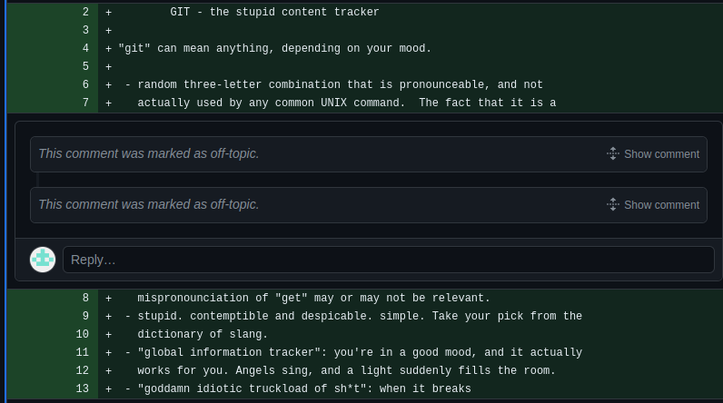

# Git/Github 
Say you're working on a difficult piece of code. You make a change, and everything breaks. You want one of your fellow software/electrical students to go back to the old version and help you fix it: but how? Git and Github!

Git is a method of version control: it allows you to safely make changes to your code and have the confidence that you can rollback to older versions. GitHub allows you to use the git framework to be able to collaborate with others through an online repository. Here's a brief video that'll explain the background behind Github: 

<iframe width="720" height="540" src="https://www.youtube.com/embed/w3jLJU7DT5E" frameborder="0"> </iframe>

Go through this resource to see the advantages of Git: [https://dev.to/milu_franz/git-explained-the-basics-igc] Don't worry too much about the commands listed at the bottom, as we won't be using that method of Github version control.

And just for funsies, this is the README for the first git commit, git itself: 



## Setting up your account
Alright, before we dive into the weeds of it, let's create your Github account to be able to access the dpengineering organization. Navigate to [this page] and fill out all of your information. Be sure to choose a serious username, as this is going to be used to track your commits. 

Now, be sure to sign up for the [student developer pack] to be able to get sweet freebies from github! You'll have to select the Dos Pueblos Engineering Academy as your school, and upload a photo of your school ID. As our IDs are on Minga, I'd reccomend taking a screenshot of your ID, emailing that photo to yourself, accessing that email on your drive, and uploading that to the page. Little bit convoluted, but gets the job done.

You'll also want access to the dpengineering organization. Send an email [or just ask] whatever teacker is in charge of software (at present, Mr. Harlow) to add you to the organization and they'll be happy to. 

## Github Desktop 
The traditional way to use Git and Github is through the command line. However, the command line is not a streamlined process for pushing and pulling, particularly with the Github authentication manager, so we'll be covering how to use the Github Desktop application instead. The process for installing the Github Desktop app is a little bit precarious as well, as it's not supported out of the box for Linux. There are solutions, however! We'll install Github Desktop through the terminal, which will rely on your newfound command line mastery. 

Copying and pasting text contained within the terminal requires an additional key: rather than just Ctrl-V, you need to type in Ctrl-Shift-V. The same applies to copying text from the terminal, though it's not applicable in our current scenario.
{: .note }

Enter your terminal and copy paste this whole block of commands in. The first command will prompt you for your password -- enter it in, and don't be alarmed if no text shows up, as that's standard for all passwords in the terminal. You'll also likely need to type in yes or y in the process when prompted. 

```bash
sudo wget https://github.com/shiftkey/desktop/releases/download/release-3.1.1-linux1/GitHubDesktop-linux-3.1.1-linux1.deb

sudo apt-get install gdebi-core 

sudo gdebi GitHubDesktop-linux-3.1.1-linux1.deb
```

Now, navigate to the grid of 9 at the bottom right corner of your application bar to open your window. Scroll through till you reach the application Github Desktop, and click on it. 

You should see the Github Desktop application open up. Click on the blue "Sign into Github" button, authorize the application, and enter your password. Congrats! You've now successfully integrated Github Desktop to your account. I'd reccomend adding it to your frequently used applications by dragging it into the main dock where your other applications are stored. 

Go through the instructions on "Create a tutorial repository." Some tips to help you finish:

When they prompt to open in your preferred text editor, navigate to your Documents folder, the Github folder, and the desktop-tutorial folder. Right click on the READMe.md --> Open in another Application --> Libre Office Writer, where you then can make your changes and navigate back to the Github Desktop Application.

If something doesn't work, feel free to ask for help -- Git is very tricky! 

## More information
Alright, congrats on learning about Git! 

Now, check out what Github issues are: [https://docs.github.com/en/issues/tracking-your-work-with-issues/about-issues]

READMEs: [https://docs.github.com/en/repositories/managing-your-repositorys-settings-and-features/customizing-your-repository/about-readmes]

Basic formatting: [https://docs.github.com/en/get-started/writing-on-github/getting-started-with-writing-and-formatting-on-github/basic-writing-and-formatting-syntax]. 

Documentation, everyone's favorite topic. Don't feel obligated to memorize all of this: it's meant to partially serve as a way of catalouging all of this information for reference and introducing these concepts to you as you continue through these pages. Github is one of the most important tools employed at the Engineering Academy (and any group with any sort of software engineering) for documenting and collaborating using code, so it's important that you know how to navigate around it! 

## Contributing to this project
If you spot an error or would like to add something to these documents, commit to here: https://github.com/dpengineering/softdev-training You'll use the same techniques you used in the above sections. Your fellow (and future!) seniors will thank you. 


[this page]: https://github.com/join?source=header-home
[student developer pack]: https://education.github.com/pack
[https://docs.github.com/en/issues/tracking-your-work-with-issues/about-issues]: https://docs.github.com/en/issues/tracking-your-work-with-issues/about-issues
[https://docs.github.com/en/repositories/managing-your-repositorys-settings-and-features/customizing-your-repository/about-readmes]: https://docs.github.com/en/repositories/managing-your-repositorys-settings-and-features/customizing-your-repository/about-readmes
[https://docs.github.com/en/get-started/writing-on-github/getting-started-with-writing-and-formatting-on-github/basic-writing-and-formatting-syntax]: https://docs.github.com/en/get-started/writing-on-github/getting-started-with-writing-and-formatting-on-github/basic-writing-and-formatting-syntax. 
[https://dev.to/milu_franz/git-explained-the-basics-igc]: https://dev.to/milu_franz/git-explained-the-basics-igc
[https://github.com/dpengineering/softdev-training]: https://github.com/dpengineering/softdev-training


