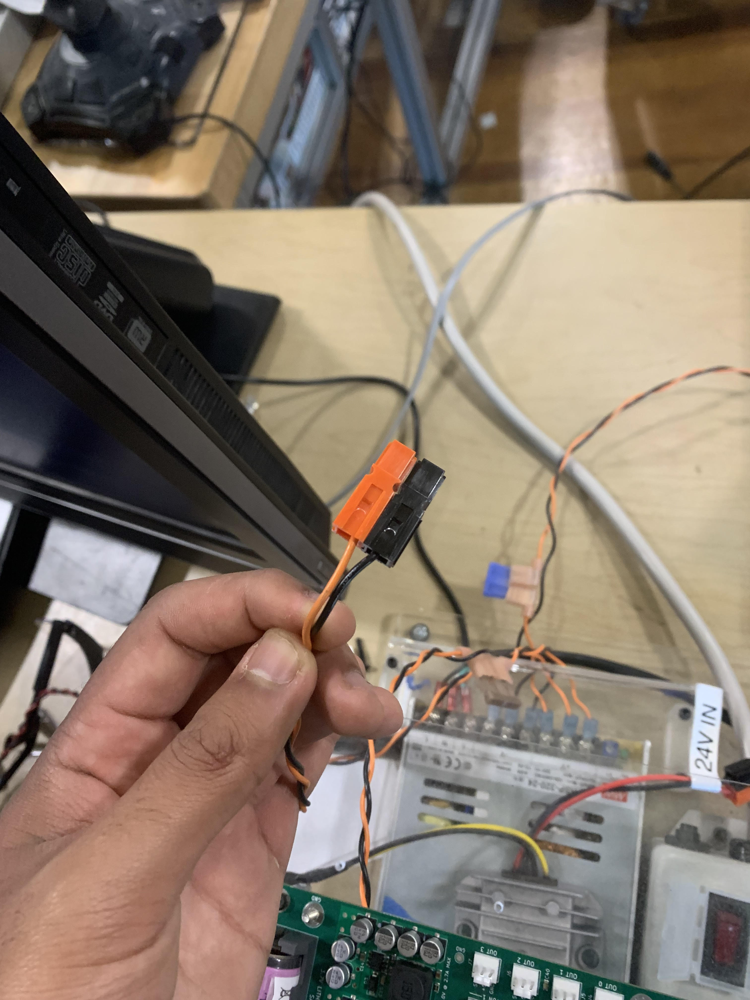
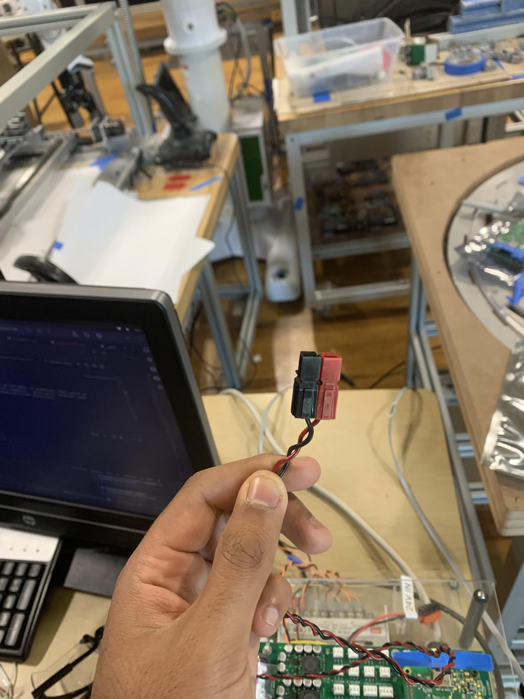

# RPi 
RPis, or Raspberry Pis, are the backbone of almost all of the projects here at the DPEA. In practice, they serve as a portable, low cost computer capable of controlling hardware through the DPi Computer+, which we'll interact with in the later sheets. This page describes the setup of the RPi both programmatically and physically. 

## Your starting place
This is where it all begins! You have a DPi Computer+ board attached to a Raspberry Pi with a power supply, plug, and a 24V to 12V step-down transformer. Attached below is a photo of this setup.

The DPi computer board provides a lot of benefits when it comes to working with the Pi beyond an interface for ports. One of these benefits is the auto-shutoff feature: when you turn off the RPi, it'll do a safe shutoff for it, allowing it to remain on while it goes through its sleep process. If this was not present, it'd basically just kill itself while sleeping if you instantaneously cut power to it. However, it does have its limitations -- be sure only to supply power back to the Pi after shutoff after it's gone through its entire shutoff process (e.g. the indicator lights on the Pi turns off)

Let's also go over some of the plug terminology. Those plugs are called Anderson Powerpoles (or more colloquially, just Powerpoles). Shown below is an orange and black connector -- those will indicate a 24V source. 

 

A 12V source is indicated by a red and black connector. This is shown below: 

It should be fairly intuitive where different plugs connect to each other. Connect 24V sources to 24V connectors, and 12V sources to 12V connectors. You also should have an external display -- hook that up through HDMI to the Pi. You'll also need an Ethernet cable -- attach that to the port on the RPi to your workstation.

Let's now go through the process of connecting your RPi to your Ubuntu machine. This seems pretty simple at first glance, but it's a shockingly annoying process to go through! As such, I strongly advise watching the setup video shown below before you go any further. 

Try and run your code on the RPi through the green play button, same as you have been for the Kivy assignments. If this does not launch on your Pi, please contact a DPEA instructor or fellow student with help in the setup of your environment!

Just a note on the connection between your computer and the Pi: really, the only unique part of the RPi compared to the Pis around you is the unique image and corresponding fingerprint loaded onto it. If you swapped around your MicroSDs and a friends MicroSD, it'd be as if you are now accessing your friends' Pi. Just food for thought. 

